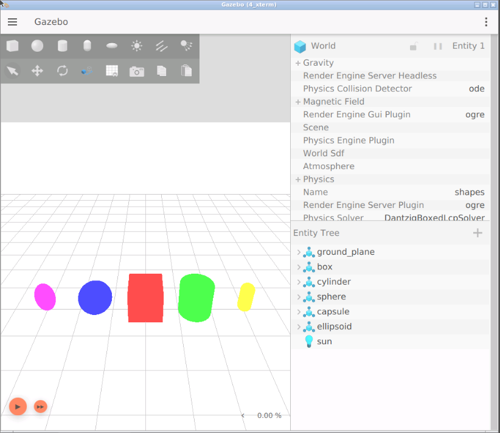
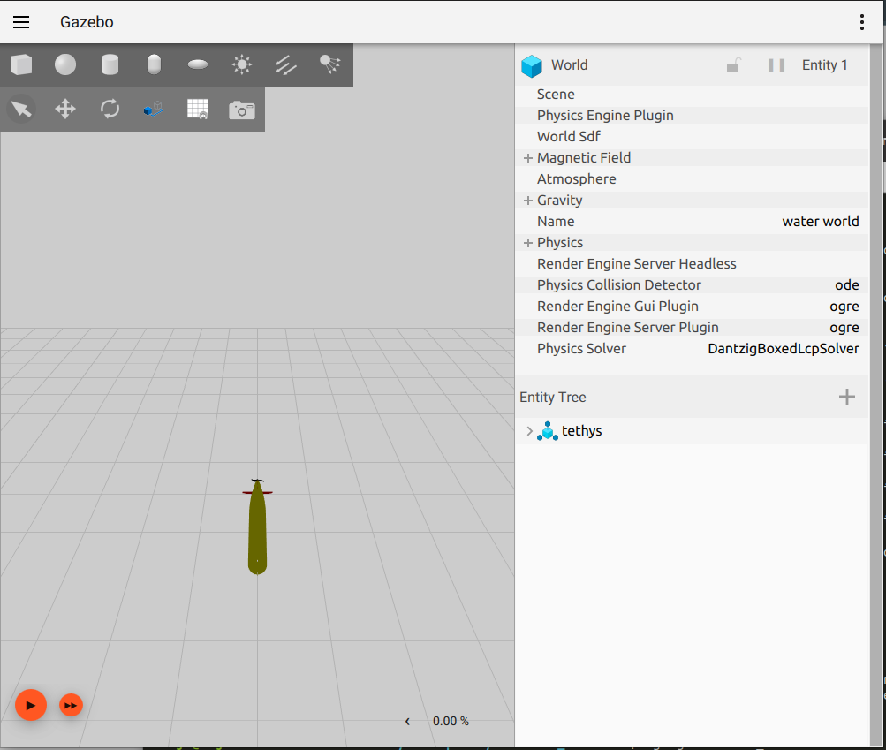
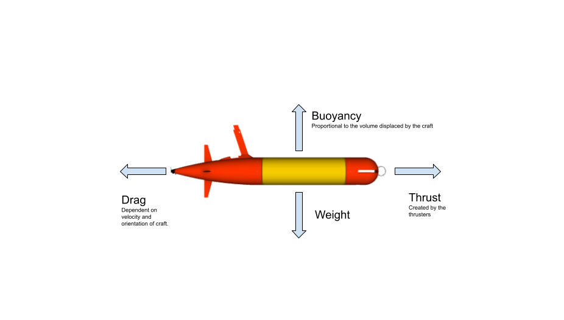
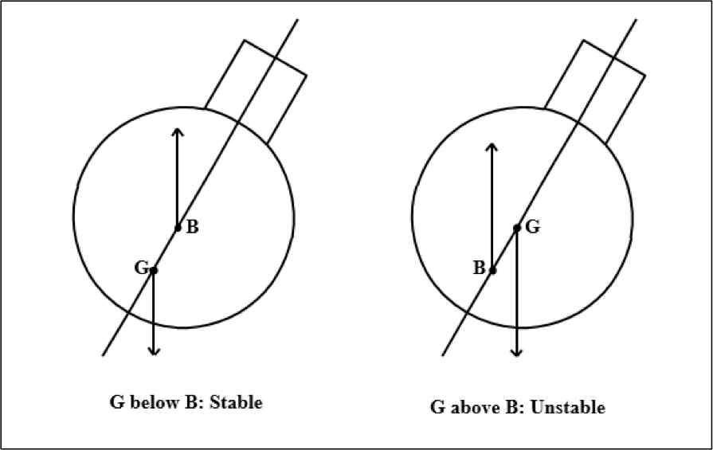
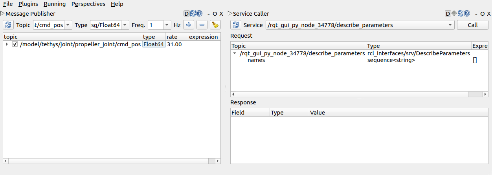

# Simulating and testing underwater robots in GazeboSim #

In this tutorial we will be using gazebosim to simulate the movement of a simple underwater glider. We will bridge this over to ROS2 and try to write some tests for its behaviour.

## What is GazeboSim

GazeboSim is the next generation of Gazebo. It started as a refactor of gazebo but turned into a complete rewrite. With GazeboSim, we have refactored gazebo into smaller components and added many new features. It will eventually supercede Gazebo Classic in 2025.


## LET'S LAUNCH THE SIMULATION

You will need a terminal for this segment
1. Go to the bottom menu and launch a terminal
2. On the screen that appears, launch the following command

To get started we will need to launch GazeboSim. In a new shell we will first install `ignition-fortress`.

```
sudo wget https://packages.osrfoundation.org/gazebo.gpg -O /usr/share/keyrings/pkgs-osrf-archive-keyring.gpg
echo "deb [arch=$(dpkg --print-architecture) signed-by=/usr/share/keyrings/pkgs-osrf-archive-keyring.gpg] http://packages.osrfoundation.org/gazebo/ubuntu-stable $(lsb_release -cs) main" | sudo tee /etc/apt/sources.list.d/gazebo-stable.list > /dev/null
sudo apt-get update
sudo apt-get install ignition-fortress
```

Now we will need to start a simulation. 
```
ign gazebo shapes.sdf
```

You will now need to have your workspace setup. Change directory into the `ros2_simulation_ws` folder and clone the following repo:
```
cd ros2_simulation_ws/src
git clone https://github.com/arjo129/maritime_sim_tutorial.git
```

Now we will build a simple simulation of the above maritime robot. In ignition gazebo. To get started lets checkout the first step
```
cd ~/ros2_simulation_ws/src/maritime_sim_tutorial
git checkout step_1
cd ~/ros2_simulation_ws/
colcon build
. install/setup.bash
```
Launch the sim using the following command
```
ign gazebo water_world.sdf
```
This will launch a simulation like so:


We will now poke around the workspace and see what is there:
```
user:~/ros2_simulation_ws/src$ tree -L 3
.
`-- maritime_sim_tutorial
    |-- LICENSE
    `-- simple_auv
        |-- CMakeLists.txt
        |-- colcon.pkg
        |-- hooks
        |-- models
        `-- worlds
```

The key files in here are `CMakeLists.txt`.
`CMakeLists.txt` installs the worlds and the models to the install folder. Additionally the `hooks` directory contains a snippet of code in `simple_auv/hooks/hook.dsv.in` like so:
```
prepend-non-duplicate;IGN_GAZEBO_RESOURCE_PATH;@CMAKE_INSTALL_PREFIX@/share/@PROJECT_NAME@/worlds
prepend-non-duplicate;IGN_GAZEBO_RESOURCE_PATH;@CMAKE_INSTALL_PREFIX@/share/@PROJECT_NAME@/models
```

This tells colcon that when we perform `. install/setup.bash` we need to export the worlds and model files to the `$IGN_GAZEBO_RESOURCE_PATH` environment variable. Ignition uses this environment variable to look for models and resources.

Now press run and see what happens. You should see the vehicle falling. This is because of gravity if you look in the world file ignition has not been told what forces to simulate. In the next few steps we will add fidelity to the simulation.

# Adding Basic Physics
The forces on the AUV are as follows:

In gazebo, we can use plugins to model various behaviours. For instance, for the buoyancy we have a `Buoyancy` plugin. Similarly there are plugins for thrusters and for drag (Hydrodynamic Damping) and many more behaviours.

## Adding Buoyancy
We are going to add a buoyancy plugin to this world to stop this from falling.

To do so open up "water_world.sdf" and add the following under the world tag:
```xml
<plugin
      filename="ignition-gazebo-buoyancy-system"
      name="ignition::gazebo::systems::Buoyancy">
  <uniform_fluid_density>1000</uniform_fluid_density>
</plugin>
```
This will tell the system to load the buoyancy plugin and create a water column with $1000kgm^{-3}$, the density of water.

Now run `colcon build` and  `ign gazebo water_world.sdf --render-engine` again and you will see nothing. This is because ignition gazebo is now loading plugins from the sdf file. All the panels you saw for rendering things and all come from other plugins. The physics system, the gui etc are all plugins. We will need to tell ignition to load these. Hence, we will need to add the following plugins like so:
```xml
    <physics name="1ms" type="ode">
      <max_step_size>0.001</max_step_size>
      <real_time_factor>1.0</real_time_factor>
    </physics>
    <plugin
      filename="ignition-gazebo-physics-system"
      name="ignition::gazebo::systems::Physics">
    </plugin>
    <plugin
      filename="ignition-gazebo-user-commands-system"
      name="ignition::gazebo::systems::UserCommands">
    </plugin>
    <plugin
      filename="ignition-gazebo-scene-broadcaster-system"
      name="ignition::gazebo::systems::SceneBroadcaster">
    </plugin>
```
This lods the physics system, the user command system which is used for interacting with the objects and finally the scene broadcaster which is used for sending the data to the screen.

> If you are lost you may simply run `git checkout step_2`

Now when you enter `colcon build` and `ign gazebo water_world.sdf --render-engine` you will see the full screen. If you hit run your robot will no longer be in free fall instead you should see nothing happen. This is ok because the only forces are gravity and buoyancy.

## Restoring Moments
For a submarine we need to make sure that there are restoring moments. These make sure that the submarine can correct itself if subject to a torque if it is tilted. 


Lets test this behaviour. Create a copy of `water_world.sdf` and call it `restoring_moments.sdf`. Change the pose of the vehicle to be slightly tilted.
```xml
    <include>
      <pose>0 0 0 0 0.1 0</pose>
      <uri>tethys</uri>
    </include>
```
Run this and you should see a slightly tilted vehicle that stays tilted. This is the wrong behaviour. We will need to tweak the buoyancy. For now buoyancy is calculated using the collision meshes making it a bit messy. We will tweak the model. Open `tethys/model/sdf` and move the collision up by a bit so that the center of buoyancy and center of gravity are different. Apply the following patch to do so. We will now see the model rock back and forth.
```diff
diff --git a/simple_auv/models/tethys/model.sdf b/simple_auv/models/tethys/model.sdf
index 0437391..be3256c 100644
--- a/simple_auv/models/tethys/model.sdf
+++ b/simple_auv/models/tethys/model.sdf
@@ -16,6 +16,7 @@
       </inertial>
 
       <collision name="main_body_buoyancy">
+        <pose>0 0 0.007 0 0 0</pose>
         <geometry>
           <box>
             <size>2 0.3 0.246445166667</size>

```
> If you are lost you may simply run `git checkout step_3`

## Interlude: Composing models

We have now defined the built in properties. The model can be uploaded to ignition fuel. There are still a few things we would like to simulate such as hydrodynamics, thrusters, lift and joints. These however will need plugins. As plugins are not part of the core SDFormat specification, it is a good idea to seperate them. We will create a new folder called `tethys_equiped` and create two files `model.config` and `model.sdf` that will host these plugins. We will update the model name:
```xml
<?xml version="1.0"?>
<model>
  <name>Tethys equipped</name>
  <version>1.0</version>
  <sdf version="1.9">model.sdf</sdf>

  <author>
    <name>Your Name</name>
    <email>email@example.com</email>
  </author>

  <description>
    3D model of MBARI LRAUV Tethys, with sensors and plugins.
  </description>
</model>
```

Then in the new `model.sdf` we will be adding:
```xml
<?xml version="1.0"?>
<sdf version="1.9">
  <model name="tethys">
    <include merge="true">
      <uri>tethys</uri>
    </include>
  </model>
</sdf>
```
This simply tells the system to include the previous model. [Model composition](http://sdformat.org/tutorials?tut=param_passing_tutorial&cat=specification&) can be an incredibly powerful tool when working with multiple robots with slight changes in behaviour. Now, update the two world files by changing the `<include>` tag with the new uri.
```xml
<include>
  <uri>tethys_equipped</uri>
</include>
```
Check that you have successfully done it by loading the worlds.
```
colcon build
ign gazebo restoring_moments.sdf --render-engine ogre
```

> If you are lost you may simply run `git checkout step_4`

## Hydrodynamic damping

We will be adding the hydrodynamic damping terms. Add the following snippet to `tethys_equiped/model.sdf` before the closing `</model>` tag:
```xml
<plugin
filename="ignition-gazebo-hydrodynamics-system"
name="ignition::gazebo::systems::Hydrodynamics">
    <link_name>base_link</link_name>
    <xDotU>-4.876161</xDotU>
    <yDotV>-126.324739</yDotV>
    <zDotW>-126.324739</zDotW>
    <kDotP>0</kDotP>
    <mDotQ>-33.46</mDotQ>
    <nDotR>-33.46</nDotR>
    <xUU>-6.2282</xUU>
    <xU>0</xU>
    <yVV>-601.27</yVV>
    <yV>0</yV>
    <zWW>-601.27</zWW>
    <zW>0</zW>
    <kPP>-0.1916</kPP>
    <kP>0</kP>
    <mQQ>-632.698957</mQQ>
    <mQ>0</mQ>
    <nRR>-632.698957</nRR>
    <nR>0</nR>
</plugin>
```
What we are doing is adding one of the [many available plugins](https://github.com/ignitionrobotics/ign-gazebo/tree/ign-gazebo6/src/systems) for the auv. Run `restoring_moments.sdf` and you should find that the oscillations we saw previously have slowed down.
> If you are lost you may simply run `git checkout step_5`

You may be wondering what these numbers are. These are coefficients used by the hydrodynamics model which implements [Fossen's hydrodynamic equations](https://books.google.com.sg/books?id=cwJUAAAAMAAJ&q=fossen+guidance+and+control+of+auvs&dq=fossen+guidance+and+control+of+auvs&hl=en&sa=X&ved=2ahUKEwiN0e3aisP3AhV1ILcAHX08AmkQ6AF6BAgEEAI).

## Thrusters

We will now finally get to the part where we can control our auv. The first system we will be adding is a thruster system. Like before we will simply be adding plugins. This time we will add the [thruster plugin](https://gazebosim.org/api/gazebo/6.9/classignition_1_1gazebo_1_1systems_1_1Thruster.html). It's goal is to apply a thrust. Add the following snippet to `tethys_equiped/model.sdf`.
```xml
<plugin
    filename="ignition-gazebo-thruster-system"
    name="ignition::gazebo::systems::Thruster">
    <namespace>tethys</namespace>
    <joint_name>propeller_joint</joint_name>
    <thrust_coefficient>0.004422</thrust_coefficient>
    <fluid_density>1000</fluid_density>
    <propeller_diameter>0.2</propeller_diameter>
</plugin>
```
Lets build and run it again:
```
colcon build
ign gazebo water_world.sdf --rendering-engine ogre
```
You should see the world as is. Hit play. We want to be able to control the vehicle. In a new terminal run the following:
```
ign topic -t /model/tethys/joint/propeller_joint/cmd_pos \
   -m ignition.msgs.Double -p 'data: -31'
```
The torpedo should be moving.

> Ignition utility command `ign` (to  be renamed `gz`) has many subcommands. Examples here include `ign gazebo` which is used for running the simulator. `ign topic` and `ign service` are similar sub commands which interface with ignition transport. Gazebo Transport is a message passing library not unlike ROS or ROS 2 which allows different proccesses to communicate with each other. Of course this mechanism has been developed for use within gazebo and not outside of it.


> Take home exercise: The fins exert a lift force when they are angled. This is used for steering. Figure out how to add LiftDrag and rotate the joints. Hint: The parameters for Lift and Drag forces on each fin is: 
```xml
<air_density>1000</air_density>
<cla>4.13</cla>
<cla_stall>-1.1</cla_stall>
<cda>0.2</cda>
<cda_stall>0.03</cda_stall>
<alpha_stall>0.17</alpha_stall>
<a0>0</a0>
<area>0.0244</area>
<cp>0 0 0</cp>
```

> As usual if lost run `git checkout step_6`


# Unit Testing
So far we have a simple torpedo. We may want to test some properties about the model and the world. Or perhaps you want to test some behaviour your controller is supposed to have. Gazebo's `TestFixture` class provides a convenient way to extract information from your simulator for unit testing. We are going to be writing some C++ code (note: there are python bindings to the TestFixture class but they are in their very early stages. We ar going to check one property of our simulation: given no external forces, the model should remain still (also known as neutral buoyancy). 

## Setting up scaffolding for unit tests using GTest
To get started we have to work on scaffolding for unit tests. First we are going to create a `tests` directory and add a simple file `test_stationary.cc`. For now we are going to just fill it witha generic GTest.
```c++
#include "gtest/gtest.h"

TEST(simple_auv_test, test_stationary) {
  EXPECT_EQ(1, 1);
}
```
We need to add some infrastucture to our CMakeFile to add google tests. Open `CMakeLists.txt` and add the following at the top:
```cmake
find_package(ignition-gazebo6 REQUIRED)
find_package(ignition-math6 REQUIRED)
find_package(ignition-transport11 REQUIRED)
```
This will tell us to find `ignition-fortress` libraries. For the actual unit tests we will add the following chunk. It will fetch [GTests](https://github.com/google/googletest) and then link the correct libraries to your

```cmake
#============================================================================
# Unit tests
include(CTest)
if(BUILD_TESTING)
  # Fetch GTest
  include(FetchContent)
  FetchContent_Declare(
    googletest
    URL https://github.com/google/googletest/archive/609281088cfefc76f9d0ce82e1ff6c30cc3591e5.zip
  )
  set(gtest_force_shared_crt ON CACHE BOOL "" FORCE)
  FetchContent_MakeAvailable(googletest)
  include(GoogleTest)

  # Link against the 
  add_executable(test_stationary tests/test_stationary.cc)
  target_include_directories(test_stationary
    PRIVATE ${CMAKE_CURRENT_BINARY_DIR})
  target_link_libraries(test_stationary
    PUBLIC
    ignition-gazebo6::ignition-gazebo6
    ignition-math6::ignition-math6
    ignition-transport11::ignition-transport11
    gtest
    gtest_main
  )
  gtest_discover_tests(test_stationary)
endif()
```

Now lets build the unit test:
```
colcon build
```

To run the tests and display outputs run the following:
```
colcon test --event-handlers=console_cohesion+
```
[`--event-handlers=console-cohesion+`](https://colcon.readthedocs.io/en/released/reference/event-handler-arguments.html) option asks colcon to show  the output of subcommands it runs (otherwise you won't be able to see the test output).

You should see the test ouput like so:
```
    Start 1: simple_auv_test.test_stationary

1: Test command: /home/arjo/workspaces/maritime_tutorial/build/simple_auv/test_stationary "--gtest_filter=simple_auv_test.test_stationary" "--gtest_also_run_disabled_tests"
1: Test timeout computed to be: 1500
1: Running main() from /home/arjo/workspaces/maritime_tutorial/build/simple_auv/_deps/googletest-src/googletest/src/gtest_main.cc
1: Note: Google Test filter = simple_auv_test.test_stationary
1: [==========] Running 1 test from 1 test suite.
1: [----------] Global test environment set-up.
1: [----------] 1 test from simple_auv_test
1: [ RUN      ] simple_auv_test.test_stationary
1: [       OK ] simple_auv_test.test_stationary (0 ms)
1: [----------] 1 test from simple_auv_test (0 ms total)
1: 
1: [----------] Global test environment tear-down
1: [==========] 1 test from 1 test suite ran. (0 ms total)
1: [  PASSED  ] 1 test.
1/1 Test #1: simple_auv_test.test_stationary ...   Passed    0.00 sec

100% tests passed, 0 tests failed out of 1
```

> If lost run `git checkout step_7`

## Actually writing the test.

We are now going to actually write our test. But before we do that we need to tell our unit tests where to find our file. Fortunately CMake has us covered. We will use CMake's [`configure_file`](https://cmake.org/cmake/help/latest/command/configure_file.html)

In a new file called `tests/TestConfig.hh.in` add the following
```c++
#ifndef __TEST_CONSTANTS_HH__
#define __TEST_CONSTANTS_HH__
#define PROJECT_BINARY_PATH "@PROJECT_BINARY_PATH@"
#define PROJECT_SOURCE_PATH "@PROJECT_SOURCE_PATH@"
#endif
```
This will allow us to access the path of the source code using the `PROJECT_SOURCE_PATH` definition.

We will need to tell CMake to generate a file called `TestConstants.hh` inside the `BUILD_TESTING` condition:
```cmake
# Build-time constants
set(PROJECT_BINARY_PATH ${CMAKE_CURRENT_BINARY_DIR})
set(PROJECT_SOURCE_PATH ${CMAKE_CURRENT_SOURCE_DIR})
configure_file(tests/TestConfig.hh.in TestConfig.hh @ONLY)
```

Now we will use the `water_world.sdf` for our unit test. In `test_stationary.cc`, copy paste the following:
```c++
#include "gtest/gtest.h"

#include <ignition/common/Console.hh>
#include <ignition/gazebo/Model.hh>
#include <ignition/gazebo/World.hh>
#include <ignition/gazebo/Server.hh>
#include <ignition/gazebo/Util.hh>
#include <ignition/gazebo/TestFixture.hh>

#include "TestConfig.hh"

TEST(simple_auv_test, test_stationary) {
  // Maximum verbosity helps with debugging
  ignition::common::Console::SetVerbosity(4);

  // Instantiate test fixture. It starts a server and provides hooks that we'll
  // use to inspect the running simulation.
  ignition::gazebo::TestFixture fixture(ignition::common::joinPaths(
    PROJECT_SOURCE_PATH, "worlds", "water_world.sdf"));

  std::size_t iterations{0};
  ignition::gazebo::Entity modelEntity;

  fixture.
  OnConfigure([&modelEntity](const ignition::gazebo::Entity &_worldEntity,
      const std::shared_ptr<const sdf::Element> &/*_sdf*/,
      ignition::gazebo::EntityComponentManager &_ecm,
      ignition::gazebo::EventManager &/*_eventMgr*/)
  {
    ignition::gazebo::World world(_worldEntity);

    // Get entity
    modelEntity = world.ModelByName(_ecm, "tethys");
    EXPECT_NE(ignition::gazebo::kNullEntity, modelEntity);
  }).
  OnPostUpdate(
  [&iterations, &modelEntity](
    const ignition::gazebo::UpdateInfo &_info,
    const ignition::gazebo::EntityComponentManager &_ecm)
  {
    // Get the pose of the model
    auto pose = ignition::gazebo::worldPose(modelEntity, _ecm);

    // Make sure its still at the same place
    EXPECT_NEAR(pose.Pos().X(), 0.0, 1e-6);
    EXPECT_NEAR(pose.Pos().Y(), 0.0, 1e-6);
    EXPECT_NEAR(pose.Pos().Z(), 0.0, 1e-6);

    // Make sure its still at the same orientation
    EXPECT_NEAR(pose.Rot().Euler().X(), 0.0, 1e-6);
    EXPECT_NEAR(pose.Rot().Euler().Y(), 0.0, 1e-6);
    EXPECT_NEAR(pose.Rot().Euler().Z(), 0.0, 1e-6);

    // Make sure we're running the test.
    iterations++;
  }).Finalize();

  // Setup simulation server, this will call the post-update callbacks.
  // It also calls pre-update and update callbacks if those are being used.
  fixture.Server()->Run(true, 1000, false);

  // Verify that the post update function was called 1000 times
  EXPECT_EQ(1000, iterations);

}
```
> If lost run `git checkout step_8`

### Whats going on?

`#include "TestConfig.hh"` includes the file we just generated.

The ignition `TestFixture` allows for us to hook into the ignition simulation when running.

`ignition::gazebo::TestFixture fixture(ignition::common::joinPaths(PROJECT_SOURCE_PATH, "worlds", "water_world.sdf"));` loads the `water_world.sdf` into the simulator. 

`fixture.OnConfigure([]{...})` tells ignition to run the lambda function when the fixture is loaded.
`fixture.OnUpdate([]{...})` tells ignition to run the lambda _after_ a simulation step. You may also have callbacks for `fixture.Update()` (for running during the simulation step) and `fixture.PreUpdate()` for things you want to do before the simulation step.

After setting up the callbacks you need to run `fixture.Finalize()` to run finalize the functions.

`fixture.Server()->Run(true, 1000, false);` steps through the  server.

Gazebo uses an [entity component system](https://en.wikipedia.org/wiki/Entity_component_system) to manage its state. All things in gazebo are Entitys for instance the world, the model,etc. Every entity has components for instance the pose of an object `ecm` maintains the list of all entities and associated components. 


> Take home exercise: change the model to break the unit test.

> Take home exercise: write a unit test that checks the vehicle moves forward when the propeller spins.

# Connecting to ROS2

Lets hook this up to ROS 2 now. In the src folder run the following:

```
git clone https://github.com/ignitionrobotics/ros_ign.git
```
This will bring in the ros2 bridge in. Build the bridge for galactic and igntion fortress.
```
git checkout galactic
export IGNITION_VERSION=fortress
colcon build
```
Run the bridge.
```
ros2 run ros_ign_bridge parameter_bridge /model/tethys/joint/propeller_joint/cmd_pos@std_msgs/msg/Float64@ignition.msgs.Double

```
Open rqt and command the vehicle forward by sending a command of -31!
```
rqt
```
